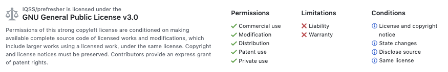

# An example project for DataFest2021
 

## Media
View this example project via a:
* [browser](https://iqss.github.io/datafest-project/)

## Aim
To provide a starting point for DataFest2021 project materials.

## Contents
This repo contains Rmarkdown files with R code and Python code for an example project for DataFest2021.

## Contributing
This material is maintained under a GPL License, and other individuals are welcome to fork, clone, or make copies of the material. Comments and suggestions are also always welcome.

